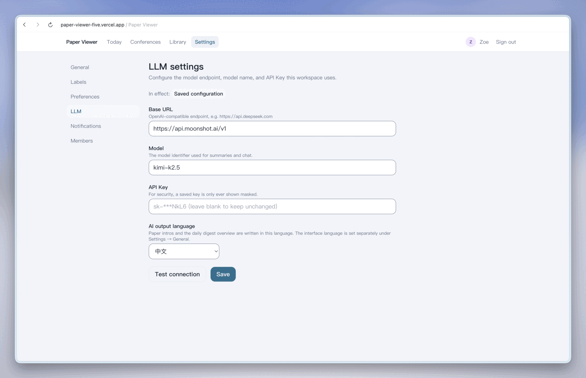
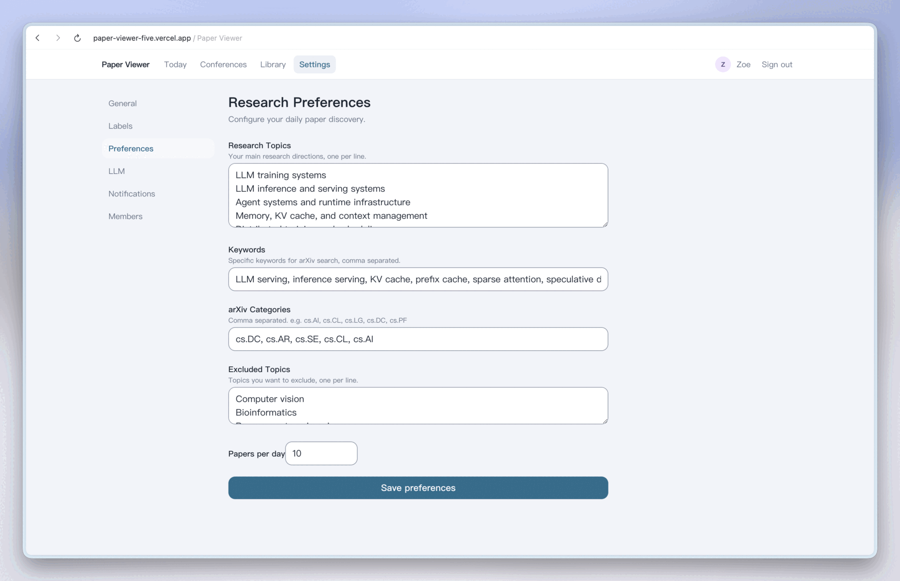
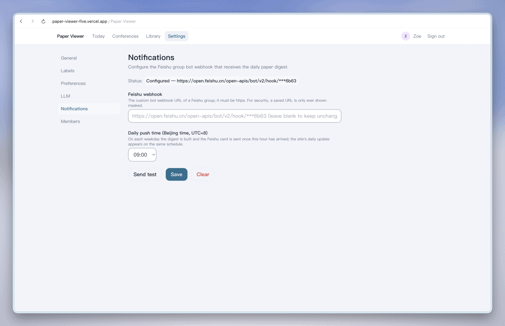

<h1 align="center">部署指南</h1>

<p align="center">
  <a href="DEPLOYMENT.md">English</a> · <strong>简体中文</strong> &nbsp;&nbsp;|&nbsp;&nbsp; <a href="README.zh-CN.md">← 返回 README</a>
</p>

---

Paper Viewer 就是照着免费额度设计的：**Vercel Hobby** 跑应用和定时任务，**Neon** 提供 Postgres，**Vercel Blob** 存 PDF。整个流程大约 15 分钟。

**目录**

1. [准备工作](#准备工作)
2. [Fork 本仓库](#1-fork-本仓库)
3. [在 Neon 上建数据库](#2-在-neon-上建数据库)
4. [在 Vercel 导入项目](#3-在-vercel-导入项目)
5. [环境变量](#4-环境变量)
6. [创建 Blob store 存 PDF](#5-创建-blob-store-存-pdf)
7. [部署并创建 owner 账号](#6-部署然后创建-owner-账号)
8. [在站内完成工作区配置](#7-在站内完成工作区配置)
9. [让每日推送准点](#8-让每日推送准点可选)
10. [自定义域名与后续更新](#9-自定义域名与后续更新)
11. [不用 Vercel 的自部署方式](#不用-vercel-的自部署方式)
12. [常见问题排查](#常见问题排查)

---

## 准备工作

| 需要什么 | 用来做什么 |
|---|---|
| GitHub 账号 | Vercel 从你 fork 的仓库部署 |
| [Vercel](https://vercel.com) 账号 | 托管 + 定时任务 |
| [Neon](https://neon.tech) 账号 | Serverless Postgres |
| 一个 LLM API key | 任意 OpenAI 兼容接口（Kimi/Moonshot、DeepSeek、OpenAI……） |
| 飞书群机器人 webhook | 可选，只在需要每日推送时用 |

---

## 1. Fork 本仓库

先 fork 到自己的 GitHub 账号下。从 fork 部署，之后才好同步上游更新，第 8 步的 GitHub Actions 触发器也需要它。

## 2. 在 Neon 上建数据库

1. 新建一个 Neon 项目，区域尽量选得离 Vercel 区域近（`vercel.json` 默认 `sin1` 新加坡，团队在别处就改掉）。
2. 在项目面板里复制**两个**连接串：

   | Neon 里的叫法 | 填到哪个变量 | 为什么 |
   |---|---|---|
   | Pooled connection（连接池） | `DATABASE_URL` | Serverless 函数会开大量短连接 |
   | Direct connection（直连） | `DIRECT_URL` | Prisma 迁移无法走连接池 |

## 3. 在 Vercel 导入项目

1. **Add New → Project**，导入你 fork 的仓库。
2. 构建设置不用改——仓库根目录的 `vercel.json` 已经写好了安装命令、构建命令、产物目录、区域和定时任务。
3. 配好下面的环境变量，然后部署。

## 4. 环境变量

在 **Vercel → Settings → Environment Variables** 里配置（Production，用到 Preview 的话也一起配）：

| 变量 | 必填 | 说明 |
|---|:---:|---|
| `DATABASE_URL` | ✅ | Neon 连接池连接串 |
| `DIRECT_URL` | ✅ | Neon 直连连接串（用于迁移） |
| `AUTH_SECRET` | ✅ | 会话 cookie 签名密钥，≥16 字符 —— `openssl rand -base64 32` |
| `INGEST_API_KEY` | ✅ | 外部 ingest 接口的鉴权，≥16 字符 |
| `APP_URL` | ✅ | 绝对地址，如 `https://your-app.vercel.app`；不配的话飞书卡片里的链接会失效 |
| `CRON_SECRET` | ✅ | `/api/cron/*` 的鉴权。**不配则每日推送根本不会跑** |
| `BLOB_READ_WRITE_TOKEN` | ✅ | 创建 Blob store 时由 Vercel 自动注入，见第 5 步 |
| `LLM_API_KEY` / `LLM_BASE_URL` / `LLM_MODEL` | 可选 | 兜底模型配置，推荐用站内按工作区配置 |
| `RESEND_API_KEY` | 可选 | 发送邀请邮件；不配就手动复制邀请链接 |
| `CONFERENCE_SOURCE_URL` | 可选 | 把顶会目录指向别的 GitHub 仓库 |
| `MAX_PDF_UPLOAD_MB` | 可选 | 上传大小上限（默认 50） |
| `S3_*` | —— | 仅本地开发使用，生产环境用 Vercel Blob |

## 5. 创建 Blob store 存 PDF

在 **Vercel → Storage → Create → Blob** 创建一个 store 并关联到项目，Vercel 会自动注入 `BLOB_READ_WRITE_TOKEN`。

实际上这一步不能省：Serverless 函数没有持久磁盘，而 PDF 快照固化正是预印本更新后标注锚点不漂移的前提。

## 6. 部署，然后创建 owner 账号

数据库迁移会在每次**生产**构建时自动执行（构建命令里就有 `prisma migrate deploy`），部署完成时表结构已经就绪；Preview 构建则有意跳过迁移。

然后打开 `https://your-app.vercel.app/bootstrap` 创建第一个账号（密码 ≥12 位），它就是工作区的 **owner**。一旦存在 owner，这个入口自动失效，不可能被用第二次。

## 7. 在站内完成工作区配置

剩下的配置都在界面里，不在环境变量里：

| 位置 | 配什么 |
|---|---|
| **Settings → LLM** | API key、base URL 和模型，以及论文导读与每日总结的「AI 生成语言」。按工作区存库，随时可换 |
| **Settings → Preferences** | 研究方向和关键词——每日推送就是按这个来的 |
| **Settings → Notifications** | 飞书 webhook 和推送时间（北京时间 0–23 点） |
| **Settings → Members** | 把组里其他人拉进来 |
| **Settings → Labels** | 全组共用的标签体系 |
| **Conferences → 同步** | 第一次同步顶会目录（数千篇，约一分钟） |

<table>
  <tr>
    <td width="33%"></td>
    <td width="33%"></td>
    <td width="33%"></td>
  </tr>
</table>

> **模型并发数很关键。** 每日推送是一篇接一篇地分析，而站内 AI 对话用的是同一个 key。如果套餐只允许 1 个并发请求，推送跑着的时候对话就会一直失败，直到推送结束。

## 8. 让每日推送准点（可选）

`vercel.json` 里带了两条工作日定时任务（UTC 01:00 和 01:30，即北京时间 09:00 和 09:30）。**Vercel Hobby 的 cron 精度是「每小时」级别——设成 9 点的任务，可能 10 点前的任何时刻才触发。** 如果希望群里每天固定时间收到卡片，就启用仓库自带的 GitHub Actions 触发器：

1. 在你 fork 的仓库：**Settings → Secrets and variables → Actions**
   - 新建 **secret** `CRON_SECRET`，值和 Vercel 那个环境变量一致
   - 新建 **variable** `APP_URL`，填你的部署地址
2. 在 fork 上启用 Actions。之后 `.github/workflows/digest-trigger.yml` 会在每个工作日整点调用 cron 接口。

它和 Vercel 自带的 cron 可以并存：接口按各工作区配置的推送时间做闸门，并且有三层幂等——运行锁、完成标记、飞书发送前先抢占标记——多余的调用只是空转，卡片每天仍然最多发一次。

> 手动点「发现论文」走的是同一条流水线，包括飞书推送，只要当天的卡片还没发出去。

## 9. 自定义域名与后续更新

- 绑了自定义域名之后记得改 `APP_URL`（以及 Actions 里的 `APP_URL` variable），否则飞书卡片里的链接还指向旧域名。
- 更新方式：把上游合进你的 fork，让 Vercel 重新部署即可，迁移会在生产构建时自动执行。

---

## 不用 Vercel 的自部署方式

任何 Node 22 环境都可以。需要一个 Postgres，PDF 存储用 S3 兼容对象存储（`S3_*`）或 Vercel Blob 二选一：

```bash
pnpm install
pnpm db:generate
pnpm --filter @paper-viewer/db exec prisma migrate deploy --schema prisma/schema.prisma
pnpm build
pnpm --filter @paper-viewer/web start
```

没有 Vercel cron 的话，自己驱动每日推送即可——任何能每小时发一次带鉴权请求的调度器都行：

```bash
curl -H "Authorization: Bearer $CRON_SECRET" https://your-host/api/cron/daily-digest
```

---

## 常见问题排查

| 现象 | 大概率原因 |
|---|---|
| 每日推送根本不跑 | `CRON_SECRET` 没配，或者研究偏好从来没保存过 |
| 推送跑了但飞书没消息 | 没配 webhook，或者当天的卡片已被更早的一次运行抢占发送 |
| 飞书卡片里的链接指向 `localhost` | `APP_URL` 没配，或者还是旧域名 |
| 对话提示 "Failed to get a reply" | 模型侧拒绝了请求——最常见的是推送运行期间撞上并发限制，或者设置页里的 key 无效 |
| 目录里的论文能看 PDF，自己上传的不行 | 没有关联 Blob store，字节没有地方持久化 |
| 导入 `dl.acm.org` / `ieeexplore.ieee.org` 链接被拒绝 | 这些站点屏蔽自动抓取 PDF，请先下载 PDF 再上传文件 |
| 构建卡在 `prisma migrate deploy` | `DIRECT_URL` 缺失，或者填成了连接池地址 |
