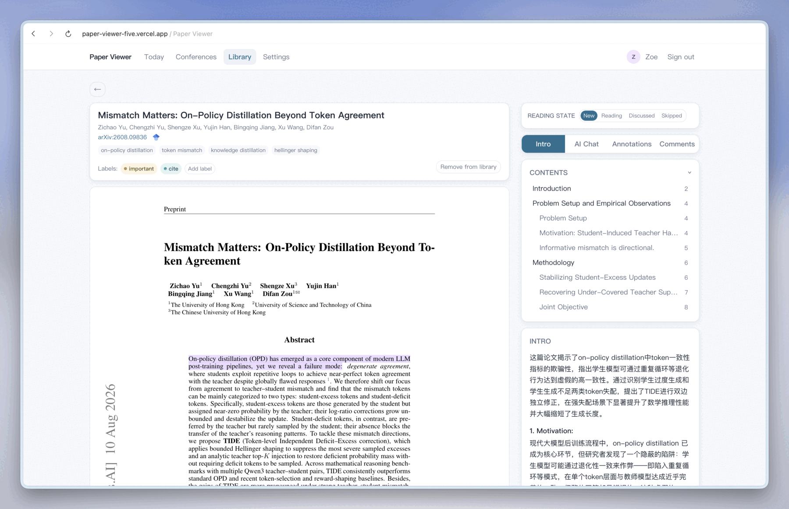
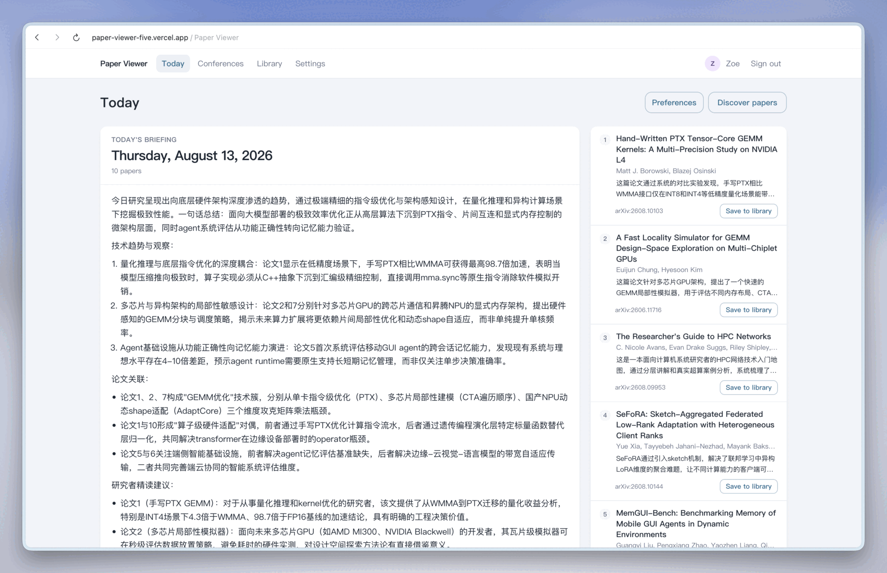
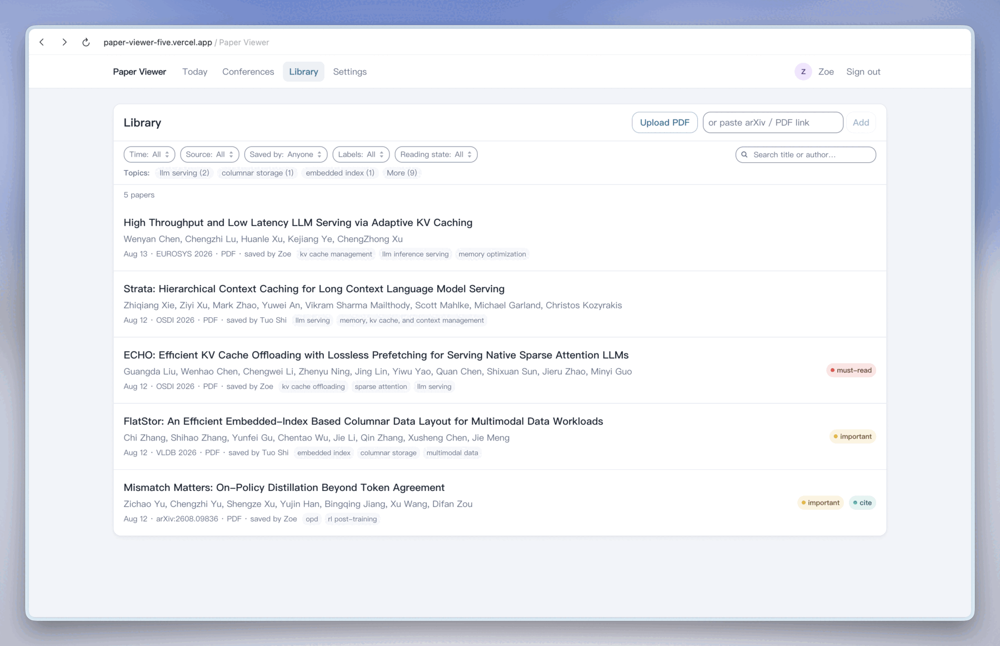
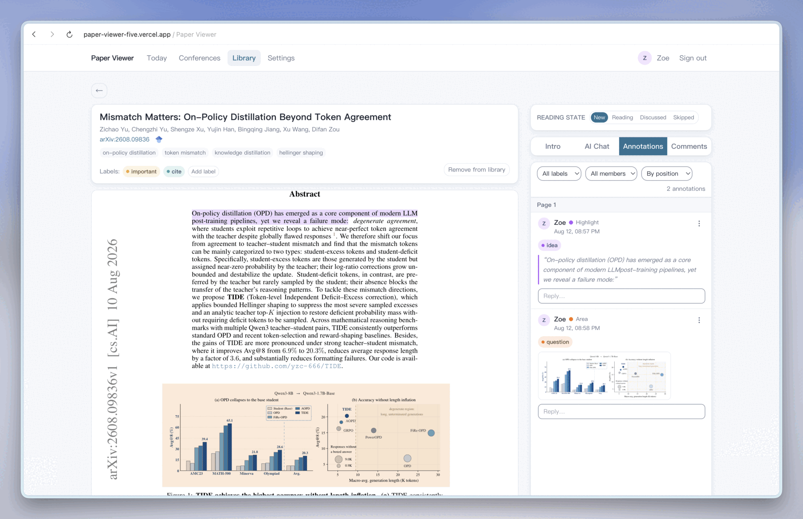
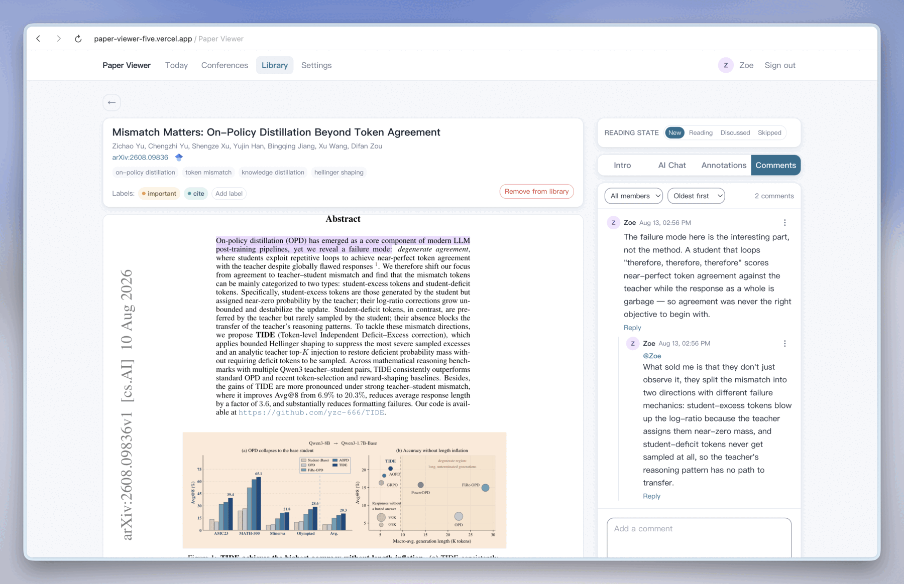
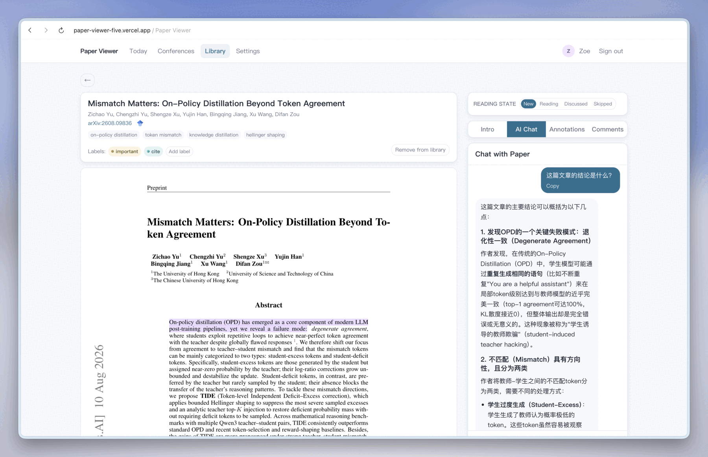

<h1 align="center">Paper Viewer</h1>

<p align="center">
  <strong>English</strong> · <a href="README.zh-CN.md">简体中文</a>
</p>

<p align="center">
  <strong>A self-hosted paper workspace where the reading group, not the reader, is the unit.</strong><br/>
  One library, one set of highlights on one copy of each PDF, one AI intro per paper, one digest a day — for everyone in the workspace.
</p>

<p align="center">
  <a href="LICENSE"></a>
  
  
  
</p>

<p align="center">
  <a href="#what-it-is-for">What it is for</a>&nbsp;&nbsp;&bull;&nbsp;&nbsp;<a href="#built-for-a-group-not-a-person">Built for a group</a>&nbsp;&nbsp;&bull;&nbsp;&nbsp;<a href="#key-features">Features</a>&nbsp;&nbsp;&bull;&nbsp;&nbsp;<a href="DEPLOYMENT.md">Deploy</a>&nbsp;&nbsp;&bull;&nbsp;&nbsp;<a href="#local-development">Local Development</a>
</p>

---

<p align="center">
  
</p>

---

## What it is for

A reading group usually runs one workflow across three separate tools: an arXiv feed or mailing list to find papers, a group chat to share them, and each person's own PDF reader to annotate them.

None of the three is shared in any useful way. A feed is subscribed to one person at a time. Chat messages scroll out of view within a day. Annotations stay on the machine that made them, so the person who read the paper most carefully is the only one who can see what they found. The group reads together and keeps nothing together.

Paper Viewer is built the other way around. It selects papers on a schedule, writes a structured intro for each, sends the day's list to the group chat, and keeps what the group decides to keep — the PDFs, the highlights everyone can see, the threads under them, and an AI chat with the full text.

It is self-hosted, runs on Vercel and Neon free tiers, and stores everything in a database you control.

---

## Built for a group, not a person

Most reading tools model a single reader and add sharing afterwards. Here the workspace is the default and the individual is the exception:

| Shared with the whole workspace | Yours alone |
|---|---|
| The library, and who saved each paper | Reading state — new, reading, discussed, skipped |
| Highlights and area selections, anchored in the PDF | Your chat history with a paper |
| The thread under each highlight, and under each paper | Interface language, stored in your browser |
| The AI intro — written once, read by everyone | |
| Labels, research topics, the model and the language it writes in | |
| The daily digest, and the single card sent to the group chat | |

Four mechanics keep that workable once several people are reading at the same time:

- **The PDF is pinned on first open.** Highlight coordinates address stored bytes, so an arXiv v2 does not move everyone's highlights out from under them.
- **An intro is generated once per workspace.** Two members opening the same new paper do not produce two analyses, or two bills — the second request is served the first one's result.
- **The daily card is claimed before it is sent.** Cron, the hourly heartbeat and someone pressing "Discover papers" can all race for the same day; the group chat still receives one card.
- **A paper reached three ways stays one entry.** DOI, arXiv id and normalized title are checked on every path in, so saving a paper a colleague already saved points at their entry instead of creating a twin.

And joining costs a member nothing, while the door stays closed:

- **Nothing to install.** A link and a browser. No extension, no desktop client, no sync account, and no per-person API key — the model is configured once for the workspace. Whoever set the deployment up did the setup for everyone.
- **Invitation only.** There is no public sign-up page. The owner account is created once at `/bootstrap`, and everyone else arrives through a single-use link that expires; only its hash is stored, never the token itself. The workspace is as private as the database you put it on, which is your own.

---

## Key Features

### 📬 Daily arXiv Digest

Each workspace configures its own research topics and keywords. On every weekday, the digest job searches arXiv, ranks the new papers against those interests, and produces the day's list.

- **Structured AI intros** — each paper gets motivation, problem, method, key findings, and why it matters, as separate fields rather than a restated abstract. Papers saved from the catalog or uploaded by hand get the same intro.
- **Daily overview** — one short summary covering the whole batch, shown above the list.
- **Feishu (Lark) push** — with a webhook and a push hour configured, the digest card is sent to the group chat at that hour, at most once per day.
- **Nothing enters the library on its own** — a paper from the daily list opens as a read-only preview: the PDF and its intro are there to read, while highlights, comments and reading state begin only once someone presses "Save to library". Ten new papers a day would otherwise bury the ones the group actually chose.



<table>
  <tr>
    <td width="33%"></td>
    <td width="33%"></td>
    <td width="33%"></td>
  </tr>
</table>

<sub>The three screens the digest runs on, each set once for the whole workspace: what it ranks against, which model writes and in which language, and where the card is sent.</sub>

### 🏛️ Top-Conference Catalog

Accepted-paper lists for major systems and database venues — currently **SOSP, OSDI, ATC, NSDI, EuroSys, ASPLOS, SIGMOD and VLDB** — synced from [csconf-papers](https://github.com/RealZST/csconf-papers).

- **Browse or search** — filter by venue and year, or search across every catalog at once.
- **Inline full text where available** — about two thirds of the catalog opens in the app; the rest link out to the publisher. Papers served from an arXiv preprint are labelled, so it is clear when the text is not the version of record.
- **Save to library** — catalog papers enter the library through the same duplicate checks as every other source.


### 📚 Shared Library

- **One entry point for every source** — the daily digest, the conference catalog, an uploaded PDF, or a pasted arXiv/DOI URL.
- **Cross-source duplicate detection** — DOI, arXiv id, and normalized title, so the same paper reached three ways stays one entry.
- **Filters and search** — by time window, label, or reading state; full-text search over titles and authors; topic chips for the most-used topics.
- **Shared labels** — a colour-coded vocabulary defined once in Settings and applied to both papers and highlights.



### 📖 Reading

- **The paper opens in the app** — the PDF renders beside its intro, threads and chat, so nothing has to be downloaded to be read.
- **Table of contents** — the PDF's own bookmarks are rendered as a clickable outline.
- **Per-user reading state** — new / reading / discussed / skipped, tracked separately for each member, and available as a library filter.
- **Keyboard navigation** — `j`/`k` move through the library order, `1`–`4` switch the sidebar panels.

### 🖍️ Shared PDF Annotation

- **Everyone marks up the same copy** — a highlight is visible to the whole workspace in its label's colour, and hovering one shows who made it and what was said under it.
- **Pinned PDF snapshots** — the file is stored on first open, so highlight anchors stay valid when arXiv publishes a new version.
- **Text and area highlights** — select a passage, or drag a box over a figure; both are stored as anchored annotations.



### 💬 Discussion

Every comment sits where the thing being discussed is, and every member sees it.

- **Two places to say something** — under the paper, or under one specific highlight, so a question about one sentence stays on that sentence.
- **Replies keep their address** — indented one level under the comment they answer, with an `@name` label.
- **Role-based moderation** — authors manage their own comments; owners and admins can edit or delete anyone's.



### 🤖 AI Chat with the Paper

- **Answers from the full text** — the PDF's text is extracted and cached on first use, so questions are answered from the paper itself, not from its abstract.
- **Your chat is yours** — the history is per member, so trying a naive question costs nothing socially.
- **Save an answer into the discussion** — one click turns a reply worth keeping into a paper comment the whole workspace can see, which is how something private becomes shared on purpose rather than by default.



### 👥 Team and Roles

- **Invitation-based membership** — invite by e-mail or by copying a link. Owner, admin and member roles.
- **Admin-only actions** — LLM keys, research preferences, the Feishu webhook, catalog syncs and member invitations. Saving a paper into the library and taking it back out are open to every member: the reading list is curated by the people reading it.

### ⚙️ Across the App

Three things that are not one feature but apply everywhere:

- **Any OpenAI-compatible model** — Kimi/Moonshot, DeepSeek, OpenAI, or a self-hosted gateway. Configured once per workspace, and the same model writes the intros, the overview and the chat answers.
- **Two independent languages** — the interface is Simplified Chinese or English per reader, stored in their browser. What language the AI writes in is a separate workspace-wide setting, so the whole group reads intros in the same language.
- **Markdown everywhere** — comments, chat answers and intros all render headings, lists, tables and code blocks, and the raw source is one click away.

---

## Deployment

Paper Viewer runs on free tiers: Vercel Hobby for the app and cron, Neon for Postgres, Vercel Blob for stored PDFs. Setup takes about 15 minutes.

**→ [Deployment guide](DEPLOYMENT.md)** — Neon and Vercel setup, environment variables, the `/bootstrap` owner account, in-app configuration, punctual digest scheduling, self-hosting without Vercel, and troubleshooting.

---

## Local Development

**Prerequisites:** Node 22+, pnpm 10 (via corepack), Docker (or your own PostgreSQL 16 + MinIO).

```bash
# 1. Services: PostgreSQL + MinIO
docker compose up -d
docker compose run --rm minio-client     # creates the paper-pdfs bucket

# 2. Configure
cp .env.example .env                     # local defaults are filled in already

# 3. Install and migrate
pnpm install
pnpm db:generate
pnpm db:migrate

# 4. Run
pnpm dev                                 # http://localhost:3000
```

Then visit `/bootstrap` to create the owner account.

### Tests

```bash
pnpm lint          # tsc across every package
pnpm test          # unit tests (vitest)
pnpm test:e2e      # Playwright; needs the dev stack running and .env exported
```

### Project layout

```
apps/web            Next.js 15 App Router app — pages, API routes, components
packages/core       Pure domain logic (permissions, labels, LLM config, upload validation)
packages/db         Prisma schema, client, migrations
packages/storage    S3 / object-storage helpers
```

**Stack:** Next.js 15 (App Router) · React 19 · Prisma 6 + PostgreSQL · Vercel Blob / S3 · next-intl · react-pdf-highlighter · pnpm workspaces · vitest + Playwright.

---

## License

[AGPL-3.0](LICENSE). If you run a modified version as a network service, the modified source must be made available to its users.
